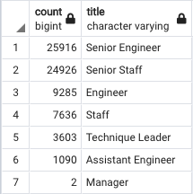

# Pewlett-Hackard-Analysis

## Overview of the analysis:
For this project, I used SQL to look into the human resources data of a fake company called "Pewlet-Hackard". I looked at the employee data to determine the number of retirement-age employees and their titles so the company can prepare to replace these positions and train the next generation. 

## Results:

Looking at the retiring titles above we can see that:
* Most vacancies will be for senior engineers and senior staff
* Only 2 managers will be retiring soon

I created a table to show employees that can be mentors to begin training staff for the upcoming vacancies. We can see that:
* There are senior engineers and senior staff on the list of mentors
* There are no managers in the mentor table

## Summary:
Looking at the retiring_titles table, we used the query "SELECT SUM(count) FROM retiring_titles;" to get the number of employees that could be retiring soon. The result is 72,458 roles that will need to be filled as the "silver tsunami" begins to make an impact.

Then, we looked at the mentors table and use the query "SELECT COUNT(emp_no) FROM mentorship_eligibility;" which helpes us get the amount of mentors that could help train the upcoming openings. There are only 1,549 eligible mentors. 
